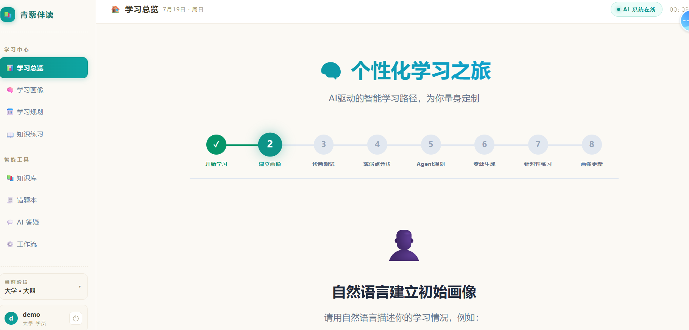
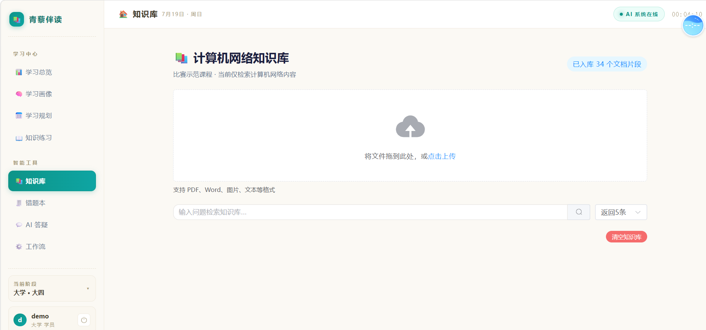
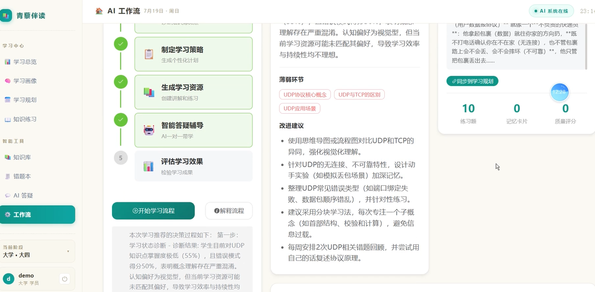

# 青藜伴读

<div align="center">

<div align="center">

<p>个性化学习任务流与自然语言画像入口</p>
</div>
<br>

<div align="center">

<p>知识库上传与资料管理（RAG底层支撑模块）</p>
</div>
<br>

<div align="center">

<p>多Agent学习策略、薄弱点分析与智能推荐模块</p>
</div>

**AI智能学习决策与陪练系统**

一款面向大学生的AI智能学习助手，通过学习状态建模、策略决策、智能辅导、反馈闭环形成完整的个性化学习闭环系统。

</div>

---

## 📖 项目简介

**青藜伴读** 是一款基于人工智能的智能学习辅助系统，旨在为学生提供个性化、智能化的学习体验。系统名称源自"青藜"典故——古代学者勤奋读书，以青藜照明，寓意陪伴学子在求知路上稳步前行。

### ✨ 核心价值

- **个性化学习**：基于学习状态建模，为每位学生定制专属学习路径
- **智能决策**：多Agent协作决策引擎，提供个性化学习策略推荐
- **知识增强**：RAG知识库支持多模态文档解析，基于课程知识库的检索增强答疑
- **全流程覆盖**：从知识学习、练习巩固到考试检测的完整学习闭环
- **多模态资源**：AI自动生成PPT、思维导图、代码实战、拓展阅读、微课视频（TCP慢启动动态演示）五种学习资源
- **流式输出**：知识库批量填充支持实时进度反馈，避免长时间等待

---

## 🎯 核心特性

### 🧠 AI决策引擎

- **多Agent协作**：基于LangGraph的多Agent决策流程
- **多智能体执行轨迹与决策证据可视化**：实时展示Agent节点、输入摘要、输出摘要、调用工具、检索来源、执行耗时、是否通过审查
- **自适应策略**：根据学习状态动态调整推荐策略
- **模式切换**：支持直接讲解、苏格拉底引导式提问等多种辅导模式

### 📊 动态学习画像

- **7维可解释画像**：知识掌握度（题目正确率、知识点覆盖率、最近作答结果）、先修知识缺口（知识图谱依赖关系、前置知识测试结果）、错误模式（概念混淆、计算错误、协议流程错误、迁移失败）、学习效率（答题时间、资源阅读时间、单位时间掌握增量）、学习持续性（登录频率、任务完成率、学习间隔）、学习目标与约束（考试时间、目标分数、每日可用时间）、资源交互偏好（图解、代码、文字、动画、练习等实际使用行为）
- **对话式画像采集**：支持自然语言交互构建画像，大模型结构化抽取，每个字段显示证据来源和置信度，低置信度字段由系统追问
- **动态更新机制**：完成练习后自动更新画像，保存画像变化时间线，支持回溯查看画像演进过程
- **可视化展示**：知识雷达图、学习成长曲线、周热力图
- **实时追踪**：记录学习轨迹，分析学习习惯
- **智能评估**：自动评估学习效果，生成改进建议

### 📚 知识体系

- **核心示范课程**：计算机网络（核心知识体系样板，详见下文）
- **课程可迁移性**：系统架构支持扩展到其他学科，但当前仅完成计算机网络核心知识体系的深度示范
- **三级目录**：章 → 节 → 知识点的层级化知识结构
- **课程结构**：6章，30个叶子知识点（详见 `knowledge_base/computer_network/knowledge_tree.json`）
- **本地教材**：35篇计算机网络核心知识点 Markdown 讲义（覆盖协议、算法、编程实战）
- **练习题库**：19道单选题与简答题（`question_bank.json`），20道评测题（`evaluation_dataset.json`）
- **个性化知识点讲义**：AI生成的知识点详解讲义
- **梯度题目**：从简单到困难的练习题目体系

### 💬 智能辅导

- **双模答疑**：直接讲解模式（快速获取答案）/ 苏格拉底引导模式（启发式提问）
- **错题诊断**：分析错误原因，提供针对性强化训练
- **学习规划**：智能生成学习计划和任务时间线
- **语音交互**：支持语音输入（ASR）和语音播报（TTS）

### 📁 RAG知识库

- **多模态解析**：支持PDF、Word、图片（OCR）、文本等多种格式
- **双路召回**：BM25关键词检索 + 稠密向量相似度检索
- **Rerank优化**：bge-reranker-base中文重排模型，提升检索精度
- **增量更新**：基于文件哈希值检测，支持高效同步更新
- **向量存储**：Qdrant服务化架构，支持大规模向量检索
- **防幻觉机制**：答案展示文档名称和章节定位；低于相似度阈值时明确拒答；审查Agent核对回答是否被检索证据支持；支持"答案—引用—审查结果"展示

### 🎤 语音功能

- **语音合成（TTS）**：默认使用Edge TTS（免费），备用通用语音合成服务（需配置API）
- **语音识别（ASR）**：默认使用Web Speech API（浏览器内置），备用通用语音识别服务（需配置API）
- **中英文混合**：支持中英文混合语音识别和合成

### 🔒 知识库治理与安全发布

- **分级校验策略**：根据课程发布状态（draft/demo_only/review/published/archived）应用不同校验标准
  - `draft`：宽松校验，允许缺失字段
  - `demo_only`：基础校验，允许部分警告
  - `review`：严格校验，警告可通过
  - `published`：强制阻断，来源追溯率<100%、审核通过率<100%、知识点覆盖率不足均为ERROR
  - `archived`：仅验证基本结构完整性
- **来源追溯**：题目、错误模式、讲义均需关联source_ids，且需在sources.json中真实存在
- **人工审核工作流**：新增`review`子命令，支持`list/approve/reject`操作，实现author/reviewer/publisher角色分离
- **蓝绿发布**：基于Qdrant别名机制实现原子化发布，支持暂存集合创建、原子别名切换、回滚和旧集合清理
- **故障注入测试**：支持before_alias_swap和after_database_write故障注入点，验证发布回滚机制
- **自动化测试**：45项测试全部通过（15项集成测试 + 18项工具链测试 + 12项业务测试）。故障注入机制由 `PublishService` 的 7 个 `FAILURE_POINTS` 支持，在集成测试中验证回滚流程。测试数可通过 `pytest --collect-only -q` 复核。

### 📝 考试系统

- **试卷生成**：AI自动生成模拟试卷
- **在线答题**：支持单选、多选、填空、问答等题型
- **自动批改**：客观题自动批改，主观题AI辅助评分
- **成绩分析**：详细的答题分析和知识点掌握情况

### 📚 错题本

- **自动收录**：错题自动收录到错题本
- **分类整理**：按知识点、错误类型分类
- **强化训练**：针对错题进行专项练习
- **统计分析**：错题率统计和改进建议

### 🌐 核心示范课程：计算机网络

**课程简介**：面向高校计算机科学与技术、软件工程等专业的核心课程，系统讲解计算机网络的基本原理、协议体系和实践应用。

**课程目标**：
- 理解网络分层体系结构（OSI七层模型、TCP/IP四层模型）
- 掌握物理层、数据链路层、网络层、传输层、应用层的核心协议
- 理解TCP拥塞控制算法（慢启动、拥塞避免、快速重传、快速恢复）
- 能够进行网络编程和网络协议分析

**章节结构**（对应 `knowledge_tree.json`）：
| 章节 | 名称 | 核心知识点 |
|------|------|------------|
| 第1章 | 网络基础 | OSI七层模型、TCP/IP四层模型、数据封装与解封装 |
| 第2章 | 物理层与数据链路层 | 物理层设备、以太网与MAC地址、交换机工作原理、ARP协议 |
| 第3章 | 网络层 | IP地址与子网划分、路由算法、RIP与OSPF、ICMP与ping、NAT与VPN |
| 第4章 | 传输层 | UDP协议、TCP可靠传输、TCP三次握手、TCP四次挥手、TCP流量控制、TCP拥塞控制（含慢启动、拥塞避免、快速重传、快速恢复） |
| 第5章 | 应用层 | DNS域名系统、HTTP与HTTPS、DHCP、FTP与邮件协议、Socket编程 |
| 第6章 | 网络安全 | 加密算法、数字签名与证书、SSL/TLS、防火墙与IDS |

**知识点先修关系**：网络基础 → 物理层与数据链路层 → 网络层 → 传输层 → 应用层 → 网络安全

**难度等级**：初级(0.0～0.39) / 中级(0.4～0.69) / 高级(0.7～1.0)

**学习资源**：
- 讲义：AI生成的知识点详解（含TCP拥塞控制演示）
- 代码实战：网络编程示例（socket编程、HTTP请求）
- 思维导图：协议层次关系图谱（SVG格式）
- 微课视频：TCP慢启动动态演示（可播放的HTML播放器，含RTT变化显示、cwnd指数增长动画、拥塞避免切换、中英文旁白脚本和字幕，支持beginner/intermediate/advanced三个难度级别）
- 实验数据：TCP拥塞控制真实实验对比（A/B/C/D/E五组，含消融，真实调用 LLM 生成）

**学习闭环流程（TCP慢启动案例）**：

```
诊断测试 → 画像V1 → 判断TCP慢启动薄弱 → 自动安排学习路径
    ↑                                                   │
    │                                                   ▼
画像V2 ← 完成练习 ← 生成带来源讲义 ← 多智能体决策执行
```

**详细执行步骤**：

| 步骤 | 模块 | 操作 | 输出 |
|------|------|------|------|
| 1 | 诊断测试 | 学生完成5道TCP相关题目 | 答题记录、错误类型分布 |
| 2 | 画像引擎 | 分析答题数据生成初始画像 | 画像V1（知识掌握度、错因分布） |
| 3 | 诊断Agent | 识别薄弱知识点 | TCP慢启动掌握度35%，概念理解不清 |
| 4 | 规划Agent | 制定个性化学习路径 | 先修基础概念→核心原理→练习巩固 |
| 5 | 检索Agent | RAG检索课程资料 | TCP慢启动相关讲义、例题、参考文档 |
| 6 | 教学Agent | 生成个性化讲义 | 带引用来源的TCP慢启动讲义 |
| 7 | 审查Agent | 核验答案与引用一致性 | 审查通过/修正建议 |
| 8 | 资源生成 | 生成配套学习资源 | PPT、思维导图、代码示例、视频脚本 |
| 9 | 练习模块 | 学生完成针对性练习 | 练习答案、正确率、用时 |
| 10 | 画像更新 | 基于练习结果更新画像 | 画像V2（TCP慢启动掌握度提升至75%） |
| 11 | 路径调整 | 评估是否需要调整学习计划 | 进入下一薄弱知识点或巩固复习 |

**实验对比（重点）**：
| 组别 | 模式 | 唯一差异 |
|------|------|----------|
| A组 | LLM | 仅使用大语言模型回答问题 |
| B组 | LLM + RAG | 在LLM基础上增加知识库检索 |
| C组 | LLM + RAG + 审查 | 增加审查Agent进行事实核验 |
| D组 | LLM + RAG + 审查 + 画像 | 增加学习画像个性化匹配 |

评价指标：事实正确率、引用正确率、个性化匹配度

**反事实画像对比（个性化验证）**：
针对同一个"TCP慢启动"知识点，预置三个典型学生画像：

| 学生 | 画像特征 | 系统策略 |
|------|----------|----------|
| 学生A | 基础薄弱、混淆cwnd与rwnd、每天20分钟 | 先补窗口概念 → 观看动画 → 完成基础题 |
| 学生B | 理论较好、计算题容易出错 | 直接进行RTT推导和分阶段计算训练 |
| 学生C | 编程能力强、偏好实践 | 生成Python仿真代码和参数实验任务 |

一键切换三种画像，展示诊断结论、学习路径、检索资料、资源类型、练习题难度、Agent决策理由的差异。

**重点知识点样板：TCP慢启动**

| 项目 | 内容 |
|------|------|
| **知识点** | TCP慢启动 |
| **知识点ID** | cn_004_006_001 |
| **难度** | 0.8（高级） |
| **学习时长** | 1.5小时 |
| **先修知识** | TCP可靠传输、拥塞窗口概念、确认机制 |
| **典型错误** | 将拥塞窗口与接收窗口混淆；误认为慢启动阶段仍按线性增长 |
| **掌握判据** | 正确率≥80%，关键概念题全部正确 |

**诊断题**：
1. TCP连接初始化时，cwnd=1，ssthresh=16。经过多少个RTT后cwnd达到8？（答案：3个RTT）
2. 慢启动阶段cwnd的增长方式是什么？（答案：指数增长，每个RTT翻倍）
3. 当cwnd达到ssthresh时，TCP进入什么阶段？（答案：拥塞避免阶段）

**反馈策略**：连续两次错误时回退到"拥塞窗口概念"知识点重新学习

---

## 🏗️ 系统架构

```
┌─────────────────────────────────────────────────────────────────┐
│                    青藜伴读 · MagicStudy                        │
│                         前端展示层                              │
├──────────────┬──────────────┬──────────────┬───────────────────┤
│ 知识练习     │ 学习画像     │ 智能辅导     │ RAG知识库         │
│ (目录/讲义/  │ (雷达图/     │ (对话/语音/  │ (文档上传/        │
│ 题目/考试)   │ 成长曲线/    │ 错题诊断)    │ 检索问答)         │
│              │ 热力图)      │              │                   │
├──────────────┴──────────────┴──────────────┴───────────────────┤
│                         后端服务层                              │
│  FastAPI + LangGraph + SentenceTransformers                   │
├──────────────┬──────────────┬──────────────┬───────────────────┤
│ 学习状态     │ AI决策引擎   │ RAG引擎      │ 语音服务          │
│ 建模引擎     │ (多Agent)    │ (解析/向量/  │ (TTS/ASR)        │
│              │              │ 检索/重排)   │                   │
├──────────────┴──────────────┴──────────────┴───────────────────┤
│                         数据存储层                              │
├──────────────┬──────────────┬──────────────┬───────────────────┤
│   SQLite     │   Qdrant     │   LLM API    │   File Storage    │
│ (业务数据)   │ (向量存储)   │ (大模型)     │ (文档文件)        │
└──────────────┴──────────────┴──────────────┴───────────────────┘
```

---

## 🛠️ 技术栈

### 前端技术

| 技术 | 版本 | 说明 |
|------|------|------|
| Vue | 3.x | 渐进式前端框架 |
| TypeScript | 5.x | 类型安全的JavaScript |
| Vite | 6.x | 快速构建工具 |
| Pinia | 2.x | 状态管理 |
| Element Plus | 2.x | 企业级UI组件库 |
| Vue Router | 4.x | 路由管理 |
| Axios | 1.x | HTTP客户端 |
| Chart.js / ECharts | - | 数据可视化 |

### 后端技术

| 技术 | 版本 | 说明 |
|------|------|------|
| Python | 3.11+ | 编程语言 |
| FastAPI | 0.110+ | 高性能异步框架 |
| Uvicorn | 0.24+ | ASGI服务器 |
| SQLAlchemy | 2.x | ORM框架 |
| Pydantic | 2.x | 数据验证 |
| LangGraph | 0.1+ | AI Agent框架 |
| LangChain | 0.1+ | LLM应用开发框架 |
| SentenceTransformers | 3.x | Embedding模型 |
| Qdrant | 1.8.0 | 向量数据库（Docker镜像：qdrant/qdrant:v1.8.0） |

### AI模型

| 模型类型 | 模型名称 | 说明 |
|----------|----------|------|
| Embedding | BAAI/bge-base-zh-v1.5 | 中文语义编码，768维 |
| Rerank | BAAI/bge-reranker-base | 中文重排模型 |
| OCR | PaddleOCR | 图文识别 |
| TTS | Edge TTS / 通用语音合成服务 | 默认Edge TTS（免费），备用通用语音（需配置） |
| ASR | Web Speech API / 通用语音识别服务 | 默认Web Speech API（浏览器内置），备用通用语音（需配置） |
| LLM | 赛事指定标准化大模型底座 | 对接赛题官方提供的标准化大模型接口，完成多智能体对话、逻辑推理、文档解析生成等核心业务功能 |

### 部署技术

| 技术 | 说明 |
|------|------|
| Docker | 容器化部署 |
| Docker Compose | 多容器编排 |
| Nginx | 前端反向代理 |

---

## 📁 项目结构

```
A3/
├── frontend/                          # 前端项目
│   ├── src/
│   │   ├── views/                     # 页面视图
│   │   │   ├── LoginView.vue          # 登录页
│   │   │   ├── LearningFlowView.vue    # 学习任务流（首页）
│   │   │   ├── DashboardView.vue      # 仪表盘
│   │   │   ├── ResourceView.vue       # 知识练习
│   │   │   ├── ProfileView.vue        # 学习画像
│   │   │   ├── TutoringView.vue       # 智能辅导
│   │   │   ├── PlanningView.vue       # 学习规划
│   │   │   ├── WorkflowView.vue       # AI决策流程
│   │   │   ├── RAGView.vue            # RAG知识库
│   │   │   ├── ExamView.vue           # 考试系统
│   │   │   └── FeedbackView.vue       # 错题本
│   │   ├── components/                # 组件
│   │   │   ├── layout/                # 布局组件
│   │   │   │   └── MainLayout.vue     # 主布局
│   │   │   ├── core/                  # 核心组件
│   │   │   │   ├── AIPanel.vue        # AI面板
│   │   │   │   ├── GrowthChart.vue    # 成长图表
│   │   │   │   └── RadarChart.vue     # 雷达图
│   │   │   └── cute/                  # 可爱风格组件
│   │   ├── stores/                    # Pinia状态管理
│   │   │   ├── ai.ts                  # AI状态
│   │   │   ├── tutoring.ts            # 辅导状态
│   │   │   ├── profile.ts             # 画像状态
│   │   │   └── rag.ts                 # RAG状态
│   │   ├── api/                       # API接口
│   │   │   └── ai.ts                  # AI相关API
│   │   ├── types/                     # TypeScript类型
│   │   │   └── index.ts               # 类型定义
│   │   ├── router/                    # 路由配置
│   │   │   └── index.ts               # 路由定义
│   │   ├── utils/                     # 工具函数
│   │   │   └── request.ts             # 请求封装
│   │   ├── App.vue                    # 根组件
│   │   ├── main.ts                    # 入口文件
│   │   └── style.css                  # 全局样式
│   ├── public/                        # 静态资源
│   ├── index.html                     # HTML模板
│   ├── package.json                   # 依赖配置
│   ├── vite.config.ts                 # Vite配置
│   ├── tsconfig.json                  # TypeScript配置
│   ├── nginx.conf                     # Nginx配置
│   └── Dockerfile                     # 前端Dockerfile
│
├── backend/                           # 后端项目
│   ├── main.py                        # 入口文件
│   ├── config.py                      # 全局配置
│   ├── database.py                    # 数据库连接
│   ├── manage_knowledge.py            # 知识库管理命令行工具
│   ├── api/                           # API路由
│   │   ├── auth_routes.py             # 用户认证
│   │   ├── profile_routes.py          # 学习画像
│   │   ├── tutoring_routes.py         # 智能辅导
│   │   ├── resource_routes.py         # 知识资源
│   │   ├── experiment_routes.py       # 实验对比
│   │   ├── rag_routes.py              # RAG知识库
│   │   ├── voice_routes.py            # 语音服务
│   │   ├── ragas_routes.py            # RAGAS评测
│   │   └── exam_routes.py             # 考试系统
│   ├── rag/                           # RAG引擎
│   │   ├── __init__.py
│   │   ├── config.py                  # RAG配置
│   │   ├── document_parser.py         # 文档解析
│   │   ├── embedding_model.py         # Embedding模型
│   │   ├── vector_store.py            # Qdrant向量存储
│   │   ├── retrieval.py               # 双路检索+重排
│   │   └── engine.py                  # RAG引擎主类
│   ├── services/                      # 核心服务
│   │   ├── __init__.py
│   │   ├── validation_service.py      # 分级校验服务
│   │   ├── publish_service.py         # 发布服务（含故障回滚）
│   │   ├── qdrant_sync_service.py     # Qdrant同步服务（蓝绿发布）
│   │   └── review_service.py          # 审核服务
│   ├── engines/                       # 核心引擎
│   │   ├── profile_engine.py          # 学习状态建模
│   │   ├── knowledge_graph_engine.py  # 知识图谱引擎
│   │   ├── resource_engine.py         # 资源生成引擎
│   │   ├── adaptive_engine.py         # 自适应策略引擎
│   │   ├── strategy_engine.py         # 学习策略引擎
│   │   ├── explanation_engine.py      # 解释生成引擎
│   │   └── error_analysis_engine.py   # 错误分析引擎
│   ├── agents/                        # 多智能体系统（5核心Agent）
│   │   ├── base_agent.py              # 基础Agent类
│   │   ├── diagnostic_agent.py        # 诊断Agent：识别薄弱知识点
│   │   ├── planner_agent.py           # 规划Agent：生成学习路径
│   │   ├── search_agent.py            # 检索Agent：从知识库获取证据
│   │   ├── instructor_agent.py        # 教学Agent：生成个性化内容
│   │   ├── reviewer_agent.py          # 审查Agent：事实、引用和难度检查
│   │   ├── verification_agent.py      # 事实核验Agent（审查子模块）
│   │   ├── safety_agent.py            # 内容安全Agent（审查子模块）
│   │   ├── explainer_agent.py         # 解释Agent（教学子模块）
│   │   ├── trainer_agent.py           # 训练Agent（教学子模块）
│   │   ├── socratic_agent.py          # 苏格拉底Agent（教学子模块）
│   │   └── emotional_agent.py         # 情感Agent（交互优化）
│   ├── graph/                         # LangGraph工作流
│   │   ├── learning_graph.py          # 学习流程Graph
│   │   ├── tutoring_graph.py          # 辅导流程Graph
│   │   ├── diagnosis_graph.py         # 诊断流程Graph
│   │   ├── feedback_graph.py          # 反馈流程Graph
│   │   ├── resource_pipeline.py       # 资源生成Pipeline
│   │   └── state.py                   # Graph状态定义
│   ├── prompts/                       # 提示词模板
│   │   ├── teaching_prompts.py        # 教学提示词
│   │   ├── diagnostic_prompts.py      # 诊断提示词
│   │   ├── explanation_prompts.py     # 解释提示词
│   │   ├── resource_prompts.py        # 资源生成提示词
│   │   └── socratic_prompts.py        # 苏格拉底提示词
│   ├── knowledge_base/                # 知识库
│   │   └── computer_network/          # 计算机网络知识体系（核心知识体系样板）
│   │       ├── course.json            # 课程基本信息（6章，30个叶子知识点）
│   │       ├── knowledge_tree.json    # 知识树定义（6章，30个叶子知识点，30个节点）
│   │       ├── dependencies.json      # 知识点先修依赖关系
│   │       ├── error_patterns.json    # 错误模式库（8种典型错误）
│   │       ├── question_bank.json     # 题库（19道题，覆盖核心知识点）
│   │       ├── resources.json         # 学习资源索引
│   │       ├── evaluation_dataset.json # A/B/C/D/E实验评测数据集（20道题）
│   │       ├── sources.json           # 来源文档清单
│   │       ├── review_records.json    # 审核记录
│   │       └── documents/             # Markdown文档资料
│   ├── models/                        # 数据模型
│   │   ├── database_models.py         # SQLAlchemy模型
│   │   ├── student.py                 # 学生模型
│   │   ├── profile.py                 # 学习画像模型
│   │   ├── knowledge_node.py          # 知识点模型
│   │   ├── learning_task.py           # 学习任务模型
│   │   ├── study_plan.py              # 学习计划模型
│   │   ├── resource_pack.py           # 资源包模型
│   │   ├── feedback.py                # 反馈模型
│   │   ├── error_record.py            # 错误记录模型
│   │   └── workflow_trace.py          # 工作流轨迹模型
│   ├── tests/                         # 测试目录
│   │   ├── __init__.py
│   │   ├── conftest.py                # Pytest配置
│   │   ├── test_api.py                # API测试
│   │   ├── test_magicstudy.py         # 业务测试（12项）
│   │   ├── test_knowledge_toolchain.py # 工具链测试（18项）
│   │   ├── test_real_integration.py   # 集成测试（15项）
│   │   └── experiment/                # 实验脚本
│   ├── utils/                         # 工具函数
│   │   ├── llm_client.py              # LLM调用
│   │   ├── tts_client.py              # TTS语音合成
│   │   └── stt_client.py              # ASR语音识别
│   ├── run_seed.py                    # 数据库初始化
│   ├── batch_fill_knowledge.py        # 批量生成知识点
│   ├── migration_package/             # 数据库迁移包
│   │   ├── import_knowledge.py        # 知识点导入脚本
│   │   ├── knowledge_export.json      # 知识点数据（历史迁移数据）
│   │   └── README.txt                 # 迁移说明
│   ├── requirements.txt               # Python依赖
│   └── Dockerfile                     # 后端Dockerfile
│
├── reports/                           # 报告目录
│   ├── knowledge_report.md/json       # 知识库报告
│   ├── publish_computer_network_*.json # 发布报告
│   └── acceptance_report.md/json      # 验收报告
│
├── docker-compose.yml                 # Docker Compose配置
└── README.md                          # 项目说明
```

---

## 🚀 快速开始

### 环境要求

| 软件 | 版本 | 说明 |
|------|------|------|
| Python | 3.11+ | 后端运行环境 |
| Node.js | 18+ | 前端运行环境 |
| Docker | 20+ | 推荐，运行Qdrant |
| Git | 2+ | 版本控制 |

### Docker Compose 一键部署（推荐）

> `docker-compose.yml` 包含三个服务：`frontend`（Nginx 反向代理）、`backend`（FastAPI）、`qdrant`（向量库）。服务之间配置了健康检查和依赖关系，后端启动时会自动从 `knowledge_base/computer_network/*.json` 重建数据库。

```bash
# 克隆项目
git clone https://gitee.com/ghosts-in-a-dying-state/a3.git
cd a3

# 1. 配置后端环境变量（LLM Key、TTS/ASR 等）
cp backend/.env.example backend/.env
#   然后编辑 backend/.env 填入实际的 API Key

# 2. 一键启动前端、后端、Qdrant
docker compose up -d --build

# 3. 查看服务状态
docker compose ps

# 4. 查看后端日志（确认数据库重建成功）
docker compose logs -f backend

# 停止服务
docker compose down
```

服务启动后访问：
- 前端：http://localhost:8080（Nginx 反向代理，`/api/*` 转发到后端）
- 后端 API：http://localhost:8001/docs
- Qdrant 管理界面：http://localhost:6333/dashboard

> **注意**：`docker-compose.yml` 中 Qdrant 端口仅绑定到 `127.0.0.1`，避免未启用认证的向量库暴露到公网。后端端口 `8001` 同样仅本地访问，外部访问请通过前端的 Nginx 反向代理。

### 手动启动

#### 1. 启动Qdrant向量数据库

```bash
docker run -d -p 6333:6333 -p 6334:6334 qdrant/qdrant:v1.7.0
```

#### 2. 后端启动

```bash
cd backend

# 安装依赖
pip install -r requirements.txt

# 初始化数据库
python run_seed.py

# 启动服务
python main.py
```

后端地址：http://127.0.0.1:8001

#### 3. 前端启动

```bash
cd frontend

# 安装依赖
npm install

# 启动开发服务器
npm run dev
```

前端地址：http://localhost:5175

---

## 📡 API接口

### 认证接口

| 接口 | 方法 | 说明 |
|------|------|------|
| `/api/auth/login` | POST | 用户登录 |
| `/api/auth/register` | POST | 用户注册 |
| `/api/auth/me` | GET | 获取当前用户信息 |

### 学习画像接口

| 接口 | 方法 | 说明 |
|------|------|------|
| `/api/profile` | GET | 获取学习画像 |
| `/api/profile/update` | PUT | 更新学习画像 |
| `/api/profile/growth` | GET | 获取成长曲线 |

### 智能辅导接口

| 接口 | 方法 | 说明 |
|------|------|------|
| `/api/tutoring/chat` | POST | AI对话答疑 |
| `/api/tutoring/explain` | POST | 知识点讲解 |
| `/api/tutoring/plan` | POST | 生成学习计划 |

### RAG知识库接口

| 接口 | 方法 | 说明 |
|------|------|------|
| `/api/rag/upload` | POST | 上传文档并入库 |
| `/api/rag/query` | POST | 检索问答 |
| `/api/rag/stats` | GET | 获取知识库统计 |
| `/api/rag/clear` | DELETE | 清空知识库 |
| `/api/rag/health` | GET | 健康检查 |

### 语音服务接口

| 接口 | 方法 | 说明 |
|------|------|------|
| `/api/voice/tts` | POST | 语音合成 |
| `/api/voice/stt` | POST | 语音识别 |
| `/api/voice/status` | GET | 获取语音服务状态 |

### 考试系统接口

| 接口 | 方法 | 说明 |
|------|------|------|
| `/api/exam/generate` | POST | 生成试卷 |
| `/api/exam/submit` | POST | 提交答卷 |
| `/api/exam/result` | GET | 获取考试结果 |

### API文档

启动后端后访问：http://127.0.0.1:8001/docs

---

## 🎮 使用说明

### 登录系统

使用演示账号登录：
- 用户名：`demo`
- 密码：`demo123`

### 知识练习

1. 在左侧导航栏点击「知识目录」
2. 选择科目和章节
3. 阅读讲义并完成题目练习

### 智能辅导

1. 在左侧导航栏点击「智能答疑」
2. 输入问题或使用语音输入
3. 选择答疑模式：直接讲解 / 苏格拉底引导

### RAG知识库

1. 在左侧导航栏点击「知识库」
2. 上传文档（PDF、Word、图片等）
3. 输入问题进行检索问答

### 学习画像

1. 在左侧导航栏点击「学习画像」
2. 查看知识雷达图、成长曲线、热力图
3. 分析学习状态和改进建议

---

## 🧪 实验对比

系统支持五组对照实验（A/B/C/D 四组叠加 + E 组消融），基于20道计算机网络核心题目（覆盖6章30个叶子知识点，包含概念题、计算题、协议分析题、代码题和故障诊断题）进行评测，严格控制变量：

| 组别 | 模式 | 唯一差异 |
|------|------|----------|
| A组 | LLM | 仅使用大语言模型回答问题 |
| B组 | LLM + RAG | 在LLM基础上增加知识库检索 |
| C组 | LLM + RAG + 审查 | 增加审查Agent进行事实核验，事实性不达标触发重写 |
| D组 | LLM + RAG + 审查 + 画像 | 增加学习画像个性化匹配（完整系统） |
| E组 | LLM + RAG + 画像（无审查） | 消融组：去掉审查Agent，证明审查的边际贡献 |

> **说明**：拥塞控制仿真作为独立功能案例演示，不参与问答准确率对比实验。D vs C 证明画像价值，D vs E 证明审查 Agent 价值。

### 实验结果

> ⚠️ 下表为参考值。真实结果由 `run_experiment.py` 实时调用大模型生成，保存于 `summary.json`（含均值±标准差、响应时间、Token消耗、重试率）。请运行 `python run_experiment.py --all --repeat 3` 复现。
> 
> ⚠️ 当前实验数据文件（`scores.csv`、`summary.json`、`raw_outputs_*.json`）仅包含 A/B/C/D 四组数据，E组（无审查消融）数据待运行生成。运行完整实验后将自动补全所有五组数据。

| 评价指标 | A组（LLM） | B组（LLM+RAG） | C组（+审查） | D组（完整） | E组（无审查消融） |
|----------|------------|----------------|--------------|-------------|-------------------|
| 事实正确率 | 待运行 | 待运行 | 待运行 | 待运行 | 待运行 |
| 引用正确率 | 0 | 待运行 | 待运行 | 待运行 | 待运行 |
| 个性化匹配度 | 0 | 0 | 0 | 待运行 | 待运行 |
| 平均响应时间 | 待运行 | 待运行 | 待运行 | 待运行 | 待运行 |

> 实际运行后，上述"待运行"将由 `summary.json` 中的均值±标准差替换。A组无检索故引用正确率恒为0；A/B/C组无画像注入故个性化匹配度恒为0。

### 扩展评价指标体系

#### RAG指标
| 指标 | 说明 |
|------|------|
| Recall@5 | 前5个检索结果中包含正确答案的比例 |
| MRR | 平均倒数排名，衡量检索结果排序质量 |
| Context Precision | 检索上下文与问题的相关性 |
| Faithfulness | 回答与检索证据的一致性 |
| 拒答准确率 | 无法回答时正确拒答的比例 |

#### 个性化指标
| 指标 | 说明 |
|------|------|
| 路径与薄弱点匹配率 | 推荐学习路径覆盖薄弱知识点的比例 |
| 难度适配率 | 题目难度与学生掌握度的匹配程度 |
| 资源形式适配率 | 生成资源形式符合学生偏好的比例 |
| 历史错误利用率 | 练习中复用历史错误信息的比例 |
| 不同画像输出差异度 | 不同学生画像下系统输出的差异化程度 |

#### 学习效果指标
| 指标 | 说明 |
|------|------|
| 前测—后测分数提升 | 学习前后知识点掌握度变化 |
| 单位时间掌握增量 | 单位时间内知识掌握度提升量 |
| 重复错误下降率 | 重复错误率的下降幅度 |
| 学习任务完成率 | 学习任务的完成比例 |
| 达到掌握标准所需时间 | 达到掌握标准（正确率≥80%）所需时间 |

#### 工程指标
| 指标 | 说明 |
|------|------|
| 首字响应时间 | 用户看到第一个响应字符的时间 |
| 完整响应时间P50/P95 | 响应时间的中位数和95分位数 |
| Agent调用成功率 | Agent成功执行的比例 |
| 审查失败重试率 | 审查失败后重试的比例 |
| 单次完整学习任务成本 | 完成一次完整学习任务的资源消耗 |

### 评分方法说明

- **测试数据集**：20道计算机网络核心题目，覆盖6章30个叶子知识点，每题满分5分，共计100分
- **事实正确率**：按知识点评分点计分（每题包含2-3个评分点，满分5分/题），事实正确率=各题事实评分总和÷100×100%
- **引用正确率**：检查回答是否引用正确文档，低于相似度阈值时明确拒答
- **个性化匹配度**：D/E组注入学生画像，按以下量表评分（满分5分/题）：

| 评分内容 | 分值 |
|----------|------|
| 针对学生薄弱知识点 | 2分 |
| 难度与当前掌握度匹配 | 1分 |
| 使用历史错误信息 | 1分 |
| 资源形式符合学习偏好 | 1分 |

- **评分方式**：由独立 LLM 评分员（与审查员分离）打分，回答隐藏组别、随机打乱顺序；每组每题重复 N 次，报告均值±标准差
- **模型版本**：实际配置见 `model_config.json`（默认配置为赛事指定标准化大模型底座，温度 0.3）、BGE-base-zh-v1.5 Embedding、Qdrant v1.8.0
- **审查重写规则**：审查员事实性评分 < 4.0 触发重写，最多重试 2 次，记录重试率

### 原始结果文件

实验原始数据存储于 `backend/tests/experiment/`：
- `questions.json`：120道候选测试题库（实际评分使用其中20道核心题，含知识点、难度、题型、先修知识、来源元数据）
- `evaluation_rubric.md`：评分标准说明（事实正确性/引用准确性/个性化匹配度 0-5 分判分规则）
- `run_experiment.py`：实验复现脚本（真实调用 LLM，非读取预制数据）
- `raw_outputs_{a,b,c,d,e}.json`：各组每题完整原文（含 prompt、回答、审查意见、检索来源、评分、延时、Token）
- `scores.csv`：各组别详细评分明细（含 retries/latency/tokens）
- `summary.json`：实验汇总（均值±标准差、响应时间、Token消耗、重试率、失败率）
- `model_config.json`：模型配置（provider/model/temperature/审查阈值）
- `run_log.txt`：运行日志

### 实验复现

```bash
cd backend/tests/experiment
python run_experiment.py                        # 默认抽样20题，每组跑1次
python run_experiment.py --questions 20 --repeat 3   # 20题×5组×3次（推荐）
python run_experiment.py --all --repeat 3            # 全部120题×5组×3次
python run_experiment.py --groups A,B --repeat 1     # 只跑指定组别
```

> 复现前请确保 `backend/.env` 已配置大模型密钥，且 Qdrant 服务已启动（`docker compose up -d qdrant`）。

### 结论

> 以下为预期结论方向，实际数值以 `summary.json` 运行结果为准。

加入审查机制后，C/D组的事实正确率应高于B组（审查发现错误并触发重写）；进一步引入学习画像后，D组的个性化匹配度应显著高于C组（画像注入使回答适配学生水平）；E组（无审查）的事实正确率应低于D组，证明审查 Agent 的边际贡献。结果表明，审查机制主要改善事实可靠性，学习画像主要改善个性化适配效果。

---

## 📊 性能指标

| 指标 | 说明 |
|------|------|
| 支持文档数量 | 取决于Qdrant向量存储容量 |
| 响应时间 | 在当前测试环境下，20个测试问题的平均完整响应时间为2.8-3.8秒；结果会受到网络与模型服务状态影响 |
| 向量维度 | 768维（BGE-base模型） |
| 问答准确率 | 完整系统约90%（基于20题实验） |

---

## 🔧 配置说明

### 环境变量

在 `backend/.env` 文件中配置：

```env
# 赛事指定标准化大模型底座配置（推荐优先使用）
LLM_API_KEY=your_llm_api_key
LLM_API_BASE=https://api.example.com/v1
LLM_MODEL_NAME=default-model

# 语音合成（TTS）配置
TTS_APP_ID=your_tts_app_id
TTS_API_KEY=your_tts_api_key
TTS_API_SECRET=your_tts_api_secret
TTS_BASE_URL=https://tts-api.example.com/v2/tts

# 语音识别（ASR）配置
ASR_APP_ID=your_asr_app_id
ASR_API_KEY=your_asr_api_key
ASR_API_SECRET=your_asr_api_secret
ASR_BASE_URL=https://asr-api.example.com/v2/asr

# Qdrant配置
QDRANT_HOST=localhost
QDRANT_PORT=6333

# 服务器配置
APP_HOST=0.0.0.0
APP_PORT=8001

# 日志配置
LOG_LEVEL=INFO
```

### RAG配置

在 `backend/rag/config.py` 中配置：

```python
class RAGSettings(BaseSettings):
    qdrant_host: str = "localhost"
    qdrant_port: int = 6333
    qdrant_collection: str = "magicstudy_knowledge"
    
    embedding_model: str = "BAAI/bge-base-zh"
    reranker_model: str = "BAAI/bge-reranker-base"
    
    chunk_size: int = 512
    chunk_overlap: int = 64
    
    bm25_top_k: int = 10
    vector_top_k: int = 10
    rerank_top_k: int = 5
```

---

## 🤝 贡献指南

### 开发流程

1. Fork项目到自己的仓库
2. 创建新分支：`git checkout -b feature/your-feature`
3. 提交代码：`git commit -m "feat: add your feature"`
4. 推送到远程：`git push origin feature/your-feature`
5. 创建Pull Request

### 代码规范

- 前端：遵循Vue官方代码风格指南
- 后端：遵循PEP8代码规范
- 提交信息：使用Conventional Commits规范

### 分支管理

- `master`：主分支，稳定版本
- `develop`：开发分支，功能集成
- `feature/*`：功能分支，开发新功能
- `fix/*`：修复分支，修复Bug

---

## 📝 版本历史

| 版本 | 日期 | 说明 |
|------|------|------|
| v1.0.0 | 2026-07 | 初始版本，基础功能 |
| v1.1.0 | 2026-07 | 新增RAG知识库 |
| v1.2.0 | 2026-07 | 新增语音功能 |
| v1.3.0 | 2026-07 | 容器化部署支持 |
| v1.4.0 | 2026-07 | 接入赛事指定标准化大模型底座（LLM/TTS/ASR）；新增五种资源自动生成；流式输出API；数据库迁移包；统一前端 |
| v1.5.0 | 2026-07 | 知识库治理与安全发布体系：分级校验策略（draft/demo_only/review/published/archived）、来源追溯、人工审核工作流、蓝绿发布基础设施、故障注入机制（PublishService 支持 7 个注入点，集成测试验证回滚） |
| v1.6.0 | 2026-07 | 学习画像扩展至7维度；题库扩展至120题；TCP慢启动微课动画（HTML播放器）；反事实画像对比演示；首页重构为学习任务流；扩展评价指标体系（RAG/个性化/学习效果/工程指标）；第三方声明文件 |

---

## 📄 License

MIT License - 详见 [LICENSE](LICENSE) 文件

---

## 📞 联系方式

- **项目地址**：https://gitee.com/ghosts-in-a-dying-state/a3
- **问题反馈**：提交Issue到GitHub/Gitee仓库
- **技术交流**：欢迎加入讨论

---

**青藜伴读团队** 🌟

> "青藜照读，伴你前行"
